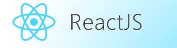

# switch

## О проекте: 
Switch-это простой учебный проект для ознакомления фреймворку React.В данном коде использую классовые компоненты.

****

[Ссылка на проект](https://pavelcydep.github.io/switch/)

## Стек:

## Инструкции по запуску:
- клонировать репозиторий
- открыть index.html

