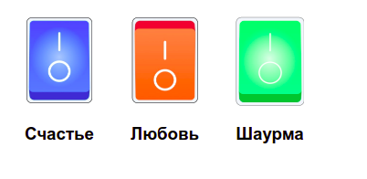

# switch

## О проекте: Switch-это простой учебный проект для ознакомления фреймворку React.

****

[Ссылка на проект](https://pavelcydep.github.io/switch/)

## Стек:

## Инструкции по запуску:
- клонировать репозиторий
- открыть index.html

